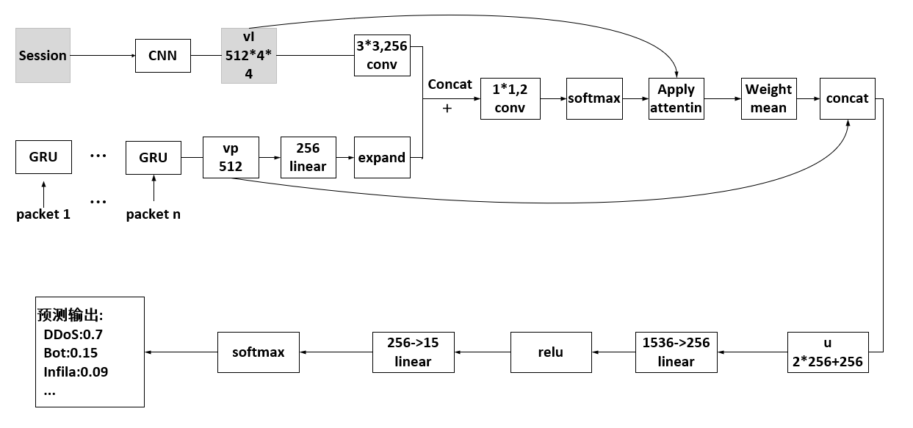
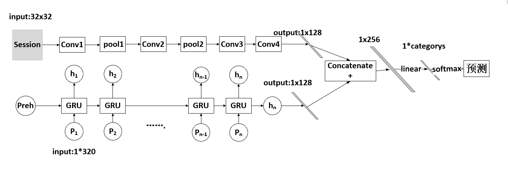

# 1.介绍

​    这是一个基于深度学习的端到端的异常入侵检测模型。思路是将网络流量数据按照五元组（源ip，目的ip，协议，源端口，目的端口），（目的ip，源ip，协议，目的端口，源端口）进行分割，将两个主机在会话中产生的所有数据包归属为一个样本，称之为会话样本。我没有采取自己在网络中收集流量的方式，而是选择了当前反映流行攻击趋势和具有较多种类的CICIDS2018S数据集，https://www.unb.ca/cic/datasets/ids-2018.html.

​	

​	在我的处理中，我按照统计学的规律对数据包个数和每个数据包的尺寸进行取舍，最后每个数据包的张量形式为：（32, 320)。分割脚本为trafficSplit中split.py文件。

  然后将数据包送入如下的网络模型中model中model_v2.py：

​    



​        fig 1. the end to end detect model

在处理pcap文件得到的80万个会话样本数据集中acc=99.96%。这是一个结合cnn和rnn和注意力机制的网络模型，是不是和问答模型很像？这确实如此，因为我的初始模型并没有注意力层，初始的设计模型结构很简单，如下所示model中的model_v1.py：



​             fig 2. the simple end to end detect model

不同于基于人工特征的入侵检测模型，本模型的决策机制是难以让人理解的，我非常好奇这个基于深度学习的端到端的模型是怎么执行入侵检测分类的，我基于梯度积分提取了模型在每个攻击类中的全局积分梯度，对模型做出了可解释性研究，train中的integrated.py模型。

详情可以参考thesis文件下的论文。

# 2 .数据下载

分割后的文件在session.rar中（即32*320的张量文件），用于描述每个样本的元信息在data.rar中。

链接：https://pan.baidu.com/s/1icVJlx5WJqwptECR3_SGJw 
提取码：well

### session.rar

1. file1-flie8 存储的是cicids2018不同pcap文件提取的会话样本，其每个file都含有benign正常样本和攻击样本。

2. ```
   files1 = [r'H:\ids2018\wed-14-02\UCAP172.31.69.25',
             r'H:\ids2018\wed-14-02\capEC2AMAZ-O4EL3NG-172.31.69.24',
             r'H:\ids2018\wed-14-02\capEC2AMAZ-O4EL3NG-172.31.69.23',
             r'H:\ids2018\wed-14-02\capEC2AMAZ-O4EL3NG-172.31.69.28']  # ftp,ssh bruteforce
   files2 = [r'H:\ids2018\thurs-15-02\UCAP172.31.69.25',
             r'H:\ids2018\thurs-15-02\capEC2AMAZ-O4EL3NG-172.31.69.17',
             r'H:\ids2018\thurs-15-02\capEC2AMAZ-O4EL3NG-172.31.69.8',
             r'H:\ids2018\thurs-15-02\capEC2AMAZ-O4EL3NG-172.31.69.12',
             r'H:\ids2018\thurs-15-02\capEC2AMAZ-O4EL3NG-172.31.69.29',
             r'H:\ids2018\thurs-15-02\capEC2AMAZ-O4EL3NG-172.31.69.30']  # dos-goldenEye,slowloris
   files3 = [r'H:\ids2018\fri-16-02\UCAP172.31.69.25-part1.pcap',  # dos slowhttptest,hulk
             r'H:\ids2018\fri-16-02\UCAP172.31.69.25-part2.pcap',
             r'H:\ids2018\fri-16-02\capEC2AMAZ-O4EL3NG-172.31.69.23',
             r'H:\ids2018\fri-16-02\capEC2AMAZ-O4EL3NG-172.31.69.24',
             r'H:\ids2018\fri-16-02\capEC2AMAZ-O4EL3NG-172.31.69.26',
             r'H:\ids2018\fri-16-02\capEC2AMAZ-O4EL3NG-172.31.69.28',
             r'H:\ids2018\fri-16-02\capEC2AMAZ-O4EL3NG-172.31.69.29',
             r'H:\ids2018\fri-16-02\capEC2AMAZ-O4EL3NG-172.31.69.30',
             ]
   files4 = [r'E:\Amazon\tuesday-20-02\UCAP172.31.69.25',
             r'E:\Amazon\tuesday-20-02\capEC2AMAZ-O4EL3NG-172.31.69.23',
             r'E:\Amazon\tuesday-20-02\capEC2AMAZ-O4EL3NG-172.31.69.24',
             r'E:\Amazon\tuesday-20-02\capEC2AMAZ-O4EL3NG-172.31.69.28',
             r'E:\Amazon\tuesday-20-02\capEC2AMAZ-O4EL3NG-172.31.69.29']  # dos loic-http
   files5 = [r'E:\Amazon\wednes-21-02\UCAP172.31.69.28-part1',  # dos loic-udp,hoic 耗时长
             r'E:\Amazon\wednes-21-02\UCAP172.31.69.28-part2']
   files6 = [r'H:\ids2018\Thurs-22-02\UCAP172.31.69.28',
             r'H:\ids2018\Thurs-22-02\UCAP172.31.69.21',
             r'H:\ids2018\Thurs-22-02\UCAP172.31.69.22',
             r'H:\ids2018\Thurs-22-02\UCAP172.31.69.25',
             r'H:\ids2018\Thurs-22-02\capEC2AMAZ-O4EL3NG-172.31.69.23',
             r'H:\ids2018\Thurs-22-02\capEC2AMAZ-O4EL3NG-172.31.69.17',
             r'H:\ids2018\Thurs-22-02\capEC2AMAZ-O4EL3NG-172.31.69.14',
             r'H:\ids2018\Thurs-22-02\capEC2AMAZ-O4EL3NG-172.31.69.10',
             r'H:\ids2018\Thurs-22-02\capEC2AMAZ-O4EL3NG-172.31.69.8',
             r'H:\ids2018\Thurs-22-02\capEC2AMAZ-O4EL3NG-172.31.69.6',
             r'H:\ids2018\Thurs-22-02\capEC2AMAZ-O4EL3NG-172.31.69.12',
             r'H:\ids2018\Thurs-22-02\capEC2AMAZ-O4EL3NG-172.31.69.26',
             r'H:\ids2018\Thurs-22-02\capEC2AMAZ-O4EL3NG-172.31.69.29',
             r'H:\ids2018\Thurs-22-02\capEC2AMAZ-O4EL3NG-172.31.69.30'
             ]  # web,xss bruteforce,sql injection
   
   files7 = [r'D:\ids2018\wed-28-02\capEC2AMAZ-O4EL3NG-172.31.69.24-part2',
             r'D:\ids2018\wed-28-02\capEC2AMAZ-O4EL3NG-172.31.69.17',
             r'D:\ids2018\wed-28-02\capEC2AMAZ-O4EL3NG-172.31.69.23',
             r'D:\ids2018\wed-28-02\capEC2AMAZ-O4EL3NG-172.31.69.26',
             r'D:\ids2018\wed-28-02\capEC2AMAZ-O4EL3NG-172.31.69.30',
             r'D:\ids2018\wed-28-02\capEC2AMAZ-O4EL3NG-172.31.69.10',
             r'D:\ids2018\wed-28-02\capEC2AMAZ-O4EL3NG-172.31.69.12',
             r'D:\ids2018\wed-28-02\capEC2AMAZ-O4EL3NG-172.31.69.14'
             ]  # infiltration
   files8 = [r'E:\Amazon\friday-02-03\capEC2AMAZ-O4EL3NG-172.31.69.23',  # bot
             r'E:\Amazon\friday-02-03\capEC2AMAZ-O4EL3NG-172.31.69.17',
             r'E:\Amazon\friday-02-03\capEC2AMAZ-O4EL3NG-172.31.69.14',
             r'E:\Amazon\friday-02-03\capEC2AMAZ-O4EL3NG-172.31.69.12',
             r'E:\Amazon\friday-02-03\capEC2AMAZ-O4EL3NG-172.31.69.29',
             r'E:\Amazon\friday-02-03\capEC2AMAZ-O4EL3NG-172.31.69.30']
   ```

### data.rar

1. unsw-nb15数据集，csv格式
2. nsl-kddcup99数据集，csv格式
3. all_flows.txt,描述全部样本元数据的文件，共计80w
4. all_train.csv,训练集，56w，70%比例
5. all_tetst.csv,测试集，24w
6. data.py,数据管道，用于将32*320的张量处理称符合模型的输入


# 3 .包介绍

- data ：data.rar解压缩后文件，建议还是从百度云下载

- dataprocess：包含对unsw，nslkdd，ids2018人工特征集的数据处理

- files：流量分割后的描述每个样本的文件

- model：两个模型

- resources：一些脚本

- thesis：两篇论文，模型可数据处理的详细介绍以及模型结果

- traffilcSplit：split.py为流量分割的代码脚本，chopping.py是给每个样本打上标签的代码

- train：classic.py基于传统机器学习方法处理csv人工特征集；train.py,模型训练和验证的过程，如果不想训练可以加载已经训练好的模型文件

  ```python
   model.load_state_dict(torch.load('model3.pth'))
  ```

  


